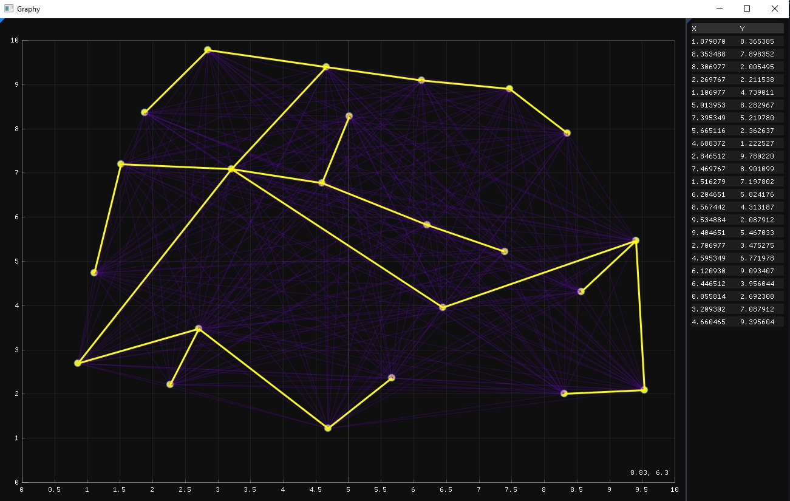

# Graphy
Visualisation of simple graph related task solution

## Task
N points are given in the plane. Construct a tree, the vertices of which are all given points, 
and the total length of all edges is minimal

## Solution
A tree, the vertices of which are all given points, 
and the total length of all edges is minimal is a connected undirected 
(since edge direction haven't mentioned) minimum spanning tree.
I'm going to show first existing MST since quantity of solutions haven't mentioned.
To build this kind of tree 
1. Form full-connected graph with all N points
2. Perform Prim's algorithm

## Realisation
I want to use C++ and the most awesome way to create GUI using C++ is Dear ImGui.

Tech stack:
- [Docking Dear Imgui](https://github.com/ocornut/imgui/tree/docking)
- [GLFW](https://www.glfw.org)
- [implot](https://github.com/epezent/implot)
- [glad](https://github.com/dav1dde/glad-web)

## Project 
- Visual Studio project management system
- [C++ project file structure](https://www.open-std.org/jtc1/sc22/wg21/docs/papers/2018/p1204r0.html) 

# References
- [nodesoup](https://github.com/olvb/nodesoup)
- [ImNodeSoup](https://github.com/Aarkham/ImNodeSoup)